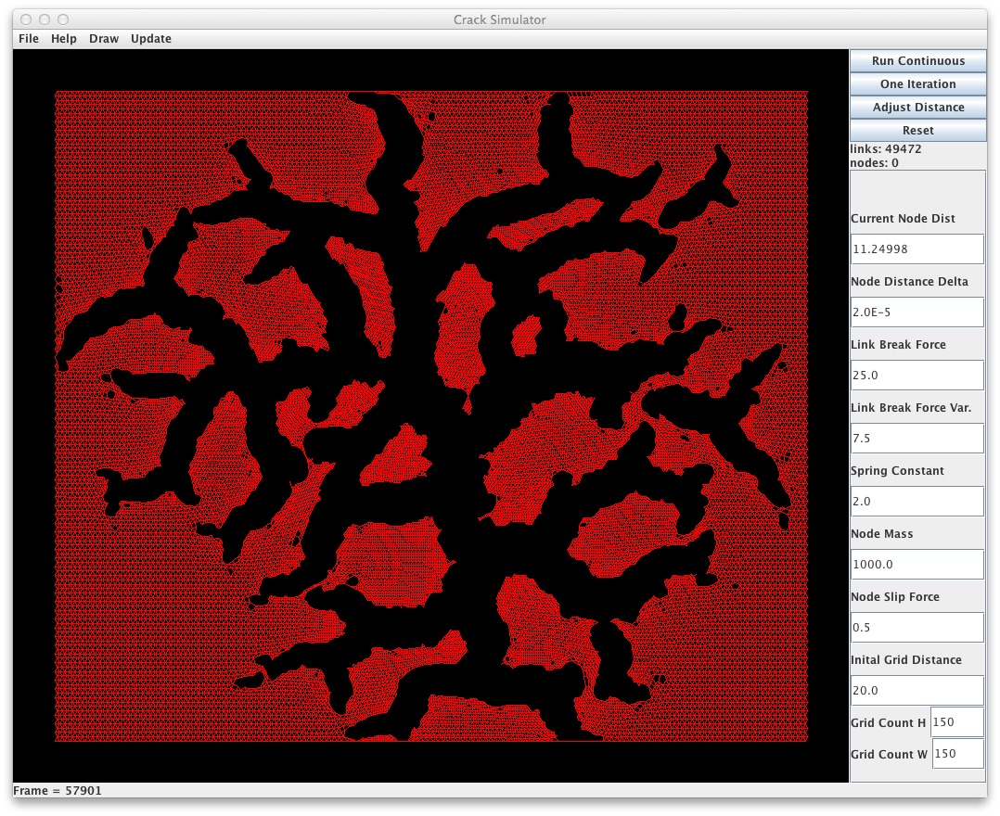

Cracks
======

Cracks simulates the tearing a fabric as the fabric shrinks. It was an
attempt to simulate the pattern of cracks that appears in drying mud.
Each thread of the fabric is modeled as a spring. Each thread also has static friction to keep it from moving until enough force is exerted ( Node Slip Force ). Each thread also has a breaking force ( Link Break Force ) and a random about of variation in the breaking force ( Link Break Force Var. ). The fabric is a grid of equilateral triangles. ( Note: Changing a parameter requires hitting return after it is entered ). Parameters can be saved to a java serialized object file. Existing parameter files are in the saved-parameters folder.

By varying the parameters you can get things like long rips, or something that shaters like a ballon when all the fabric threads are near failure.

